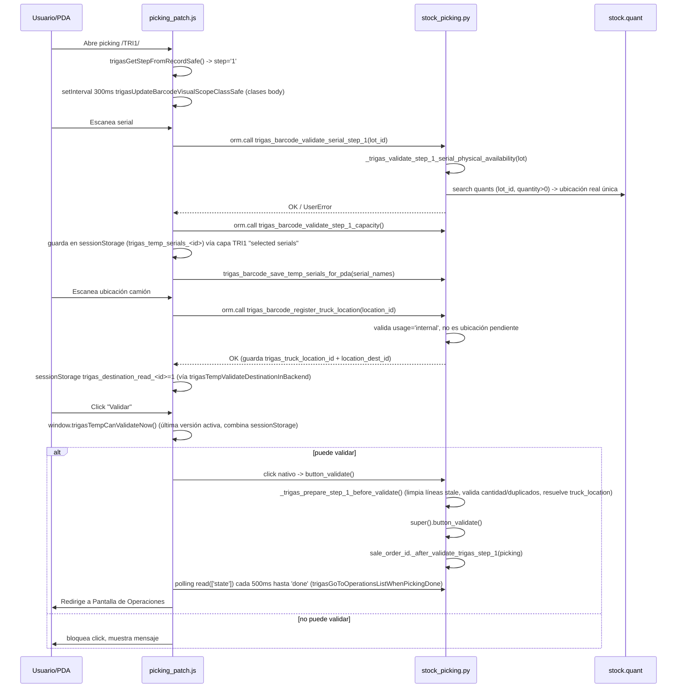
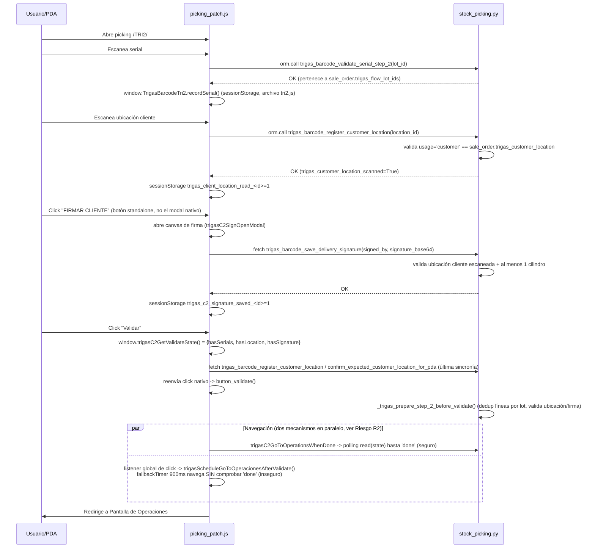

# Arquitectura del módulo `trigas_4_conduces` (alias `trigas_barcode`)

> Documento generado por auditoría de solo lectura. No refleja cambios de código —
> es un mapeo del estado actual (2026-07-01) para servir de base a una limpieza posterior.
>
> Archivos auditados en su totalidad:
> - `models/stock_picking.py` (2664 líneas)
> - `models/stock_quant.py` (64 líneas)
> - `static/src/js/trigas_barcode_picking_patch.js` (9522 líneas)
> - `static/src/js/trigas_barcode_{common,internal,tri1,tri2,tri3}.js` (477 líneas combinadas — extracciones parciales "Fase A/B/C" apenas iniciadas; casi toda la lógica real sigue en `picking_patch.js`, cargado al final según `__manifest__.py`)

---

## 0. Resumen ejecutivo

El módulo controla 3 flujos de conduce (TRI1 Entrega a Camión, TRI2 Entrega a Cliente, TRI3
Recogida) sobre `stock.picking`, apoyado en un único archivo JS de ~9500 líneas que ha
crecido por parches sucesivos ("FIX", "FINAL", "FIX DEFINITIVO", "REALLY STRONG"...) sin
retirar las capas anteriores. El patrón de fondo en los tres flujos es el mismo:

- El **backend Python** normalmente sí tiene una función canónica de "¿puedo validar?"
  (`trigas_barcode_get_signature_info`, `_trigas_prepare_step_X_before_validate`, etc.),
  pero el **frontend JS reimplementa el mismo chequeo 3-6 veces** con distintas fuentes
  (DOM, `sessionStorage`, variables `window`), y las versiones más viejas casi nunca se
  eliminan — solo se sobrescriben en tiempo de carga o quedan sin invocar.
- El estado de negocio "efímero" (¿ubicación leída?, ¿firma guardada?) vive duplicado en
  `sessionStorage` con claves por `pickingId`, lo cual es la causa raíz de que existan
  14-15 `setInterval` corriendo indefinidamente (sin `clearInterval`) para mantener el DOM
  sincronizado con ese estado disperso.
- TRI3 es un caso aparte: se trató deliberadamente como "flujo nativo de Odoo" y el JS solo
  intercepta puntos concretos, sin bloquear nunca el botón Validar (a diferencia de TRI1/TRI2
  que sí bloquean el click vía `trigasTempCanValidateNow`/`trigasC2CanValidateNow`). Esto es
  arquitectónicamente inconsistente pero no necesariamente inseguro, porque el backend
  reaplica sus propias validaciones en `button_validate()`.

---

## 1. Diagramas de flujo por TRI

### 1.1 TRI1 — Entrega a Camión



**Riesgo ya confirmado en sesión previa:** `_trigas_validate_step_1_serial_physical_availability`
(fuente correcta: `stock.quant` filtrado por `location_id.usage` y jerarquía de
`location_id` del picking) coexistía con el constraint `_check_trigas_serial_not_in_multiple_locations`
en `stock_quant.py`, que se dispara en **cualquier** escritura de `stock.quant` en todo Odoo
(no solo en el flujo Trigas) y puede ver estados transitorios de la transacción como error
definitivo. Ver Riesgo R1 en la sección 3.

### 1.2 TRI2 — Entrega a Cliente



### 1.3 TRI3 — Recogida de Cilindros

```mermaid
sequenceDiagram
    participant U as Usuario/PDA
    participant JS as picking_patch.js
    participant PY as stock_picking.py

    U->>JS: Abre picking /TRI3/ (tratado como flujo "nativo" de Odoo)
    JS->>PY: orm.call trigas_barcode_get_step_3_state() (badge destino camión)

    U->>JS: Escanea serial (origen puede ser cualquier ubicación interna/cliente)
    JS->>JS: _trigasIsTri3NativeScreen() (detección por texto DOM)
    JS->>PY: orm.call trigas_tri3_add_serial_from_any_origin(serial_name)
    PY->>PY: busca quant real del lote (internal|customer), crea/reusa stock.move + move.line
    PY-->>JS: OK (source_location real, no depende de origin fijo del picking)

    U->>JS: Escanea ubicación camión
    JS->>PY: orm.call trigas_tri3_set_truck_destination_from_barcode(location_barcode)
    PY->>PY: valida usage='internal' + is_trigas_truck_location, reescribe location_dest_id en moves/líneas

    U->>JS: Firma (modal genérico compartido con TRI2)
    JS->>PY: trigas_barcode_save_delivery_signature(...)

    U->>JS: Click "Validar" (botón 100% nativo de Odoo; JS solo le cambia el color, NUNCA lo bloquea)
    JS->>PY: click nativo -> button_validate()
    PY->>PY: _trigas_prepare_step_3_before_validate() (exige firma + destino camión válido)
    PY->>PY: super().button_validate()
    JS->>PY: polling read(state) hasta 'done' (mecanismo seguro, igual que TRI1)
    JS->>U: Redirige a Pantalla de Operaciones
```

**Nota de diseño:** a diferencia de TRI1/TRI2, no existe un `trigasTri3CanValidateNow` — el
"puede validar" de TRI3 recae 100% en el backend (`button_validate` lanza `UserError` si
falta firma o destino). Es más simple y con una sola fuente de verdad, pero rompe la
consistencia arquitectónica con los otros dos flujos y significa que el usuario solo se
entera de un bloqueo *después* de intentar validar, no antes.

---

## 2. Tabla de fuentes de verdad

| Estado de negocio | Funciones que lo calculan HOY | Fuente(s) real(es) verificada(s) | Fuente canónica recomendada |
|---|---|---|---|
| **TRI1 — seriales completos** | `trigasTempGetExpectedQty` (reasignada **4 veces**: líneas 2830, 4993, 5126, 5336, 5494 — solo la última corre), `trigasFinalRefreshState`, `trigasTempRefreshValidateState` | DOM (contador nativo Odoo) + `sessionStorage` (`trigas_fixed_expected_qty_*`, `trigas_pda_expected_qty_*`) | Backend: `trigas_barcode_get_pda_expected_qty` (ya existe, es la fuente que todas las capas JS intentan replicar) |
| **TRI1 — ubicación camión leída** | `trigasTempIsDestinationRead`, `trigasFinalDetectDestinationReadFromScreen` | `sessionStorage` (`trigas_destination_read_<id>`) con fallback a regex sobre `document.body.innerText` | Campo backend `trigas_truck_location_id` (ya existe y es escrito por `trigas_barcode_register_truck_location`) |
| **TRI1 — puede validar** | `window.trigasTempCanValidateNow` (definida 2 veces, líneas 4005 y 4578 — la segunda gana) | Combina los dos anteriores (sessionStorage-first) | Ninguna función backend equivalente existe hoy; debería crearse un `trigas_barcode_get_step_1_state` análogo al de TRI3 |
| **TRI2 — ubicación cliente leída** | `trigasC2HasClientLocation` (6534), `trigasC2FlowHasCorrectClientLocation` (6349), `trigasC2SignHasClientLocation` (6965, **muerta**) | `sessionStorage` (`trigas_client_location_read_<id>`) con fallback a texto `.trigas-destination-status` | Campo backend `trigas_customer_location_scanned` (ya existe) |
| **TRI2 — firma guardada** | `trigasC2HasSignature` (6551), `trigasC2FlowSignatureSaved` (7363), `trigasC2SignAlreadySigned` (6981, solo texto DOM) | `sessionStorage` (`trigas_c2_signature_saved_<id>`) con fallback a texto DOM | Campo backend `trigas_delivery_signature_status` (ya existe, computed) |
| **TRI2 — puede validar** | `window.trigasC2GetValidateState()` (6563) + `window.trigasC2CanValidateNow()` (6582) | Combina las 3 anteriores — **esta es hoy la más confiable de las 3 variantes conocidas**, prioriza sessionStorage sobre DOM | Backend `trigas_barcode_get_signature_info` ya calcula `can_sign`/`customer_location_ready`/`has_done_cylinders`; falta un equivalente explícito de "can_validate" reutilizable desde JS con una sola llamada |
| **TRI3 — destino camión / puede validar** | `hasTruckDestinationVisible()` (7772, solo DOM), `isSignedFrontend()` (7756, sessionStorage+DOM) | Mezcla DOM/sessionStorage para *mostrar botones*, pero el bloqueo real de Validar es 100% backend | Backend `trigas_barcode_get_step_3_state` (ya existe) — es la única fuente usada correctamente aquí; sería el modelo a replicar en TRI1/TRI2 |
| **¿En qué pantalla/flujo estoy?** | Al menos 3 heurísticas independientes reimplementadas por flujo: texto de `document.body.innerText` (`/TRI1/`, `/TRI2/`, `/TRI3/`), `window.location.href`/`hash`, y clases CSS en `<body>` mantenidas por `trigasUpdateBarcodeVisualScopeClassSafe`/`controlButtons`/`syncInternalTransferVisual` | Todas DOM/URL, sin backend | Debería derivarse una sola vez de `record.trigas_step` / `picking_type_id.sequence_code` (datos que el modelo Barcode ya tiene en memoria) y exponerse como una única función compartida |

---

## 3. Riesgos y deuda técnica, priorizados por impacto

### Bugs activos (impacto alto — pueden causar comportamiento incorrecto observable hoy)

**R1. Falsos positivos de `_check_trigas_serial_not_in_multiple_locations` durante `button_validate()`** — `models/stock_quant.py:9`
Constraint `@api.constrains` sobre `stock.quant` que se dispara en cualquier escritura a
nivel de sistema (no acotado a los flujos Trigas) y compite con la validación ya correcta
`_trigas_validate_step_1_serial_physical_availability` (`stock_picking.py:699`). Durante la
transacción de `button_validate()`, Odoo puede crear/actualizar quants en un orden que hace
que el constraint vea temporalmente el mismo lote con cantidad positiva en dos ubicaciones
antes de que el flush termine, abortando la validación con un `ValidationError` que el
usuario interpreta como un problema del serial cuando es un artefacto de timing.
*(Confirmado como causa raíz en la sesión de debugging previa a esta auditoría.)*

**R2. Condición de carrera en navegación post-validar de TRI2 (y potencialmente TRI1/TRI3)** — `trigas_barcode_picking_patch.js:8892-8951` (`trigasScheduleGoToOperacionesAfterValidate`)
El `fallbackTimer` de 900ms (línea 8940) ejecuta `finishRedirect()` → `trigasGoToOperaciones()`
**sin ninguna comprobación de `state === 'done'`** en el backend. Coexiste, en el mismo click,
con el mecanismo seguro `trigasGoToOperationsListWhenPickingDone` (línea 262, sí hace polling
hasta `state==='done'`, usado explícitamente por TRI2/TRI3 vía sus propios interceptores).
Como el listener global de línea 8953 **no llama `preventDefault()`**, ambos mecanismos se
arman en cada click de "Validar"; si `button_validate()` tarda más de 900ms, falla
silenciosamente, o el DOM deja de mostrar `.o_barcode_client_action` por cualquier otra razón
(p. ej. un modal de error de Odoo), el usuario es redirigido a Operaciones con una falsa
sensación de éxito. Pendiente confirmar con el usuario si es reproducible de forma
consistente en producción o fue solo observado en pruebas manuales de consola.

**R3. Dos listeners de teclado (escáner) corriendo simultáneamente en TRI1** — `trigas_barcode_picking_patch.js:3453-3571` y `:4587-4638`
`trigasTempHandleFinalScan` y `trigasFinalHandleScan` están registrados como
`keydown` con `capture: true` de forma independiente, cada uno con su propio buffer global
(`window.__trigasKeyboardScannerBuffer` vs `window.__trigasFinalScannerBuffer`) y cada uno
llamando `event.stopImmediatePropagation()`. No hay garantía determinista de cuál procesa
cada pulsación del lector de código de barras; es duplicación funcional real (no solo código
muerto) con potencial de escaneos perdidos o duplicados según orden de registro.

**R4. Asimetría de bloqueo de "Validar" entre TRI1/TRI2 y TRI3**
TRI1 y TRI2 bloquean el click de Validar en JS (`trigasTempCanValidateNow`,
`trigasC2CanValidateNow`) antes de dejar pasar el evento nativo. TRI3 no tiene equivalente
(`hasTruckDestinationVisible`/`isSignedFrontend` solo deciden visibilidad de botones, no
bloquean el click) — el usuario puede hacer click en "Validar" en TRI3 sin destino/firma y
recién se entera por el `UserError` que lanza `_trigas_prepare_step_3_before_validate`. No es
un bug de datos (el backend protege la integridad), pero sí una inconsistencia de UX/arquitectura
que vale la pena decidir explícitamente si se corrige o se documenta como intencional.

### Funciones duplicadas con lógica divergente (impacto medio-alto — múltiples fuentes de verdad para el mismo estado)

**R5. TRI3 tiene 4+ implementaciones parcialmente redundantes de "agregar serial recogido"** en `stock_picking.py`: `trigas_tri3_add_serial_real_location_line` (1917), `trigas_tri3_validate_serial_frontend_only` (2038, solo valida sin escribir), `trigas_tri3_commit_frontend_serials` (2113, crea todo en batch + valida), `trigas_tri3_add_serial_from_any_origin` (2240, la que realmente usa el JS activo hoy). Además `trigas_barcode_validate_serial_step_3` (1472) y `trigas_pickup_validate_frontend_scan`/`trigas_pickup_create_and_validate_from_frontend` (1686/1773) son un tercer y cuarto camino paralelo para el mismo caso de uso, con reglas de negocio (grouping de moves, validación de producto/duplicados) reimplementadas con pequeñas variaciones en cada una. Alto riesgo de que una corrección futura se aplique en una sola de las 4-6 funciones y no en las demás.

**R6. TRI1: contador de "cantidad esperada" reasignado 4 veces en tiempo de carga** (`trigasTempGetExpectedQty` → `trigasPdaGetExpectedQty` → `trigasFixedGetExpectedQty` → `trigasMobileGetExpectedQtySafe`, líneas 2830/5126/5336/5494) y "render de lista de seriales" reasignado **5 veces** (líneas 728, 2922, 3212, 3812, 4414, 6073). Solo la última versión de cada cadena tiene efecto, pero las anteriores se siguen definiendo, algunas se siguen invocando entre sí como fallback interno, y cualquier persona que edite una versión intermedia (la más fácil de encontrar por búsqueda de texto) editará código muerto sin saberlo.

**R7. TRI2: 3 verificaciones distintas de "¿ubicación cliente leída?"** (`trigasC2HasClientLocation`, `trigasC2FlowHasCorrectClientLocation`, `trigasC2SignHasClientLocation` — esta última muerta) y 2 modales de firma casi idénticos (nativo `_trigasOpenSignatureModal` líneas 860-1030, usado solo por TRI3; standalone `trigasC2SignOpenModal` líneas 7068-7258, usado por TRI2) con la misma lógica de canvas duplicada línea por línea.

### Código muerto confirmado (impacto medio — ruido que dificulta mantenimiento, sin efecto funcional directo)

- `trigasC2SignHasClientLocation` (6965), `trigasC2ReadPickingState` (6746, duplica exactamente `trigasReadPickingStateForPostValidate` línea 236), `trigasFinalGetDestinationNameForDisplay` (4355), `trigasGetCurrentBarcodePickingNameSafe` (56), `trigasTempRenderDestinationStatus` (3779) — cero invocaciones en todo el archivo.
- Rama sintácticamente inútil `if (record.trigas_false && step === '3')` duplicada en `trigasGetStepFromRecordSafe` (línea 394) y su fallback (línea 438): `record.trigas_false` no existe como propiedad real y `step` no está declarado en ese scope; el cortocircuito evita el `ReferenceError` pero la condición nunca puede ser verdadera. El mismo bug aparece copiado en ambas funciones, señal de que se duplicó el código con el bug incluido.
- 7 ocurrencias del patrón `false && step === '3' || false || ...` en TRI3 (líneas 394, 438, 1301, 1636, 1665, 1821, 1947) que dejan inalcanzable el bloque `_trigasProcessStep3RawBarcode` → `trigas_barcode_process_raw_scan_step_3` desde `_processBarcode`/`_processLot` (la ruta viva real usa `_trigasIsTri3NativeScreen`, un mecanismo distinto).
- `isTri3Screen()`/`hasSignatureModalOpen()` reimplementadas 2-3 veces de forma idéntica en distintas IIFEs en vez de compartir una sola función.
- Comentarios explícitos "CODIGO LEGACY / NO TOCAR TODAVIA" en al menos 3 bloques (líneas ~2546, ~7669, ~9430) — deuda ya reconocida por autores anteriores.
- **~80 `console.log` de diagnóstico** en todo el archivo dejados en producción, incluyendo volcados de datos de negocio completos (p. ej. línea 765 `console.log('TRIGAS: seriales PDA', serials)`, línea 6017 `'TRIGAS TRI1 SELECTED LIST DEBUG'`) y mensajes de "activo" al final de cada una de las ~15+ IIFE del archivo.
- `trigasTempSaveSerialsToBackend` (3016) queda expuesta en `window` solo para debug manual por consola (comentario explícito en línea 3166), reemplazada en el flujo real por `trigasTri1SaveSelectedSerialsToBackend` (5660).

### Optimización de performance (impacto bajo-medio a corto plazo, alto a largo plazo)

- **15 `setInterval` activos**, de los cuales **14 nunca se limpian** (`clearInterval`) — corren indefinidamente durante toda la sesión SPA sin importar en qué flujo/pantalla esté el usuario. Frecuencias: 120ms×1, 200ms×1, 250ms×1, 300ms×7, 500ms×2, 700ms×3. Varios ejecutan `document.body.innerText` completo y/o `querySelectorAll` sobre todo el árbol DOM en cada tick.
- **6 `MutationObserver`**, de los cuales **2 no tienen debounce** (líneas 2526 y 8696) y reaccionan de forma síncrona a cada mutación del DOM (potencialmente cientos de veces por segundo durante renders de Odoo); los otros 4 sí usan un `setTimeout` de ~120-600ms para agrupar ráfagas.
- **6+ listeners `click`/`keydown` globales independientes**, cada uno recorriendo el DOM por separado en cada interacción del usuario, en vez de un único despachador central.
- Estado de negocio persistido en `sessionStorage` por `pickingId` en vez de leerse siempre del backend — causa raíz estructural de por qué se necesitan tantos intervals de "sincronización visual".

---

## 4. Inventario técnico de referencia

### 4.1 `setInterval` (15 totales en `trigas_barcode_picking_patch.js` + 1 en `trigas_barcode_tri2.js`)

| # | Línea | Intervalo | Flujo | Función | `clearInterval` |
|---|---|---|---|---|---|
| 1 | 339 | 500ms | global | watchdog botón firma huérfano | No |
| 2 | 2521 | 300ms | global | `trigasUpdateBarcodeVisualScopeClassSafe` | No |
| 3 | 4283 | 700ms | TRI1 | `trigasFinalSyncTri1DestinationFromScreen` | No |
| 4 | 4640 | 700ms | TRI1 | `trigasFinalRefreshState` | No |
| 5 | 6271 | 300ms | TRI1 | `trigasFixKeepTruckLocationVisible` | No |
| 6 | 6427 | 300ms | TRI1/TRI3 | botón validar verde | No |
| 7 | 6906 | 300ms | TRI2 | patch prototipo + interceptor validar | No |
| 8 | 7305 | 500ms | TRI2 | botón flotante firmar | No |
| 9 | 7613 | 300ms | TRI2 | control firma/validar | No |
| 10 | 8037 | 300ms | TRI3 | `controlButtons` | No |
| 11 | 8132 | 200ms | TRI3 | `syncSignButtonWithModal` | No |
| 12 | 8502 | 700ms | global (menú) | estilos menú kanban | No |
| 13 | 8933 | 120ms | global post-validar | `fastWatcher` | **Sí** |
| 14 | 9038 | 250ms | TRI3 | `cleanupTri3VisualStateOutside` | No |
| 15 | 9165 | 300ms | Interna | `syncInternalTransferVisual` | No |
| — | `trigas_barcode_tri2.js:357` | 700ms | TRI2 | render lista de seriales de sesión | No |

### 4.2 `MutationObserver` (6 totales)

| Línea | Observa | Debounce | Efecto |
|---|---|---|---|
| 2526 | `document.body` (childList/subtree) | No | `trigasUpdateBarcodeVisualScopeClassSafe` |
| 8435 | `document.body` (childList/subtree/characterData) | `requestAnimationFrame` | CSS/clase menú principal |
| 8696 | `document.body` (childList/subtree) | 600ms (auto-disconnect/reconnect 1500ms) | auto-click "Nuevo" en listas TRI1/TRI3 vacías |
| 9267 | `document.body` (childList/subtree) | 120ms | limpieza visual lista Transferencias Internas |
| 9411 | `document.body` (childList/subtree) | 120ms | botón flotante "Cancelar" Interna |
| 9507 | `document.body` (childList/subtree) | 120ms | oculta tarjetas kanban vacías (global) |

### 4.3 Puntos de entrada al backend (RPC), por flujo

**TRI1:** `trigas_barcode_register_truck_location`, `trigas_barcode_validate_serial_step_1`,
`trigas_barcode_validate_step_1_capacity`, `trigas_barcode_get_scanned_serials_for_pda`,
`trigas_barcode_save_temp_serials_for_pda`, `trigas_barcode_remove_scanned_serial_for_pda`,
`trigas_barcode_validate_temp_serial_for_pda`, `trigas_barcode_validate_destination_location_for_pda`,
`trigas_barcode_get_pda_expected_qty`, `read` (genérico, campo `state`).

**TRI2:** `trigas_barcode_validate_serial_step_2`, `trigas_barcode_register_customer_location`,
`trigas_barcode_confirm_expected_customer_location_for_pda`, `trigas_barcode_save_delivery_signature`,
`trigas_barcode_get_signature_info`, `read` (genérico).

**TRI3:** `trigas_barcode_get_step_3_state`, `trigas_tri3_set_truck_destination_from_barcode`,
`trigas_tri3_add_serial_from_any_origin`, `trigas_barcode_process_raw_scan_step_3` (huérfano,
ver R-código muerto), `action_cancel` (nativo), `read` (genérico).

**Otros métodos Python definidos pero no confirmados como invocados desde el JS activo
actual** (candidatos a revisar si siguen usándose desde algún otro punto — p. ej. vistas XML,
otros módulos, o accesos manuales): `trigas_pickup_validate_frontend_scan`,
`trigas_pickup_create_and_validate_from_frontend`, `trigas_tri3_add_serial_real_location_line`,
`trigas_tri3_validate_serial_frontend_only`, `trigas_tri3_commit_frontend_serials`,
`trigas_barcode_validate_native_serial_scan`, `trigas_barcode_register_native_destination_location`.

---

## 5. Alcance no cubierto en esta auditoría

- `models/{product_template,res_partner,sale_order,stock_location,stock_lot,stock_move,stock_picking_type,x_choferes}.py`, `wizard/trigas_delivery_signature_wizard.py`, `hooks.py` — no se leyeron en esta pasada; pueden contener piezas relevantes de `_get_trigas_customer_location`, `_get_or_create_trigas_pending_locations`, `is_trigas_truck_location`, `_after_validate_trigas_step_1`, todas referenciadas desde `stock_picking.py` pero no auditadas en su propia implementación.
- `static/src/js/trigas_barcode_{common,internal,tri1,tri3}.js` se leyeron por completo (son pequeños) pero `trigas_barcode_tri2.js` (363 líneas) solo se referenció como dependencia externa de `picking_patch.js`, sin auditoría línea por línea de su lógica interna.
- No se ejecutó el módulo ni se probó ningún flujo en un entorno real — este documento es 100% análisis estático de código.

Este documento no propone cambios de código. Es la base para decidir juntos el orden de la
limpieza en una fase posterior.
